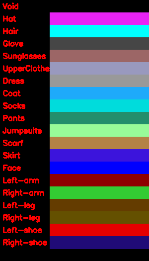

# Pytorch Implementation of Human Parsing with [PSPNet](https://arxiv.org/pdf/1612.01105.pdf) on [LIP-Look Into Person-dataset](http://openaccess.thecvf.com/content_cvpr_2017/papers/Gong_Look_Into_Person_CVPR_2017_paper.pdf) #
***

## Dataset ##
***

### Color Label Chart ###
***

# References
***

1. [Look into Person: Self-supervised Structure-sensitive Learning and A New Benchmark for Human Parsing", CVPR 2017](http://openaccess.thecvf.com/content_cvpr_2017/papers/Gong_Look_Into_Person_CVPR_2017_paper.pdf)
2. [Pyramid Scene Parsing Network](https://arxiv.org/pdf/1612.01105.pdf)
